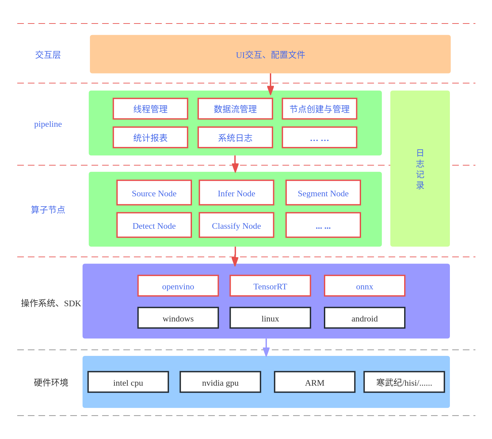
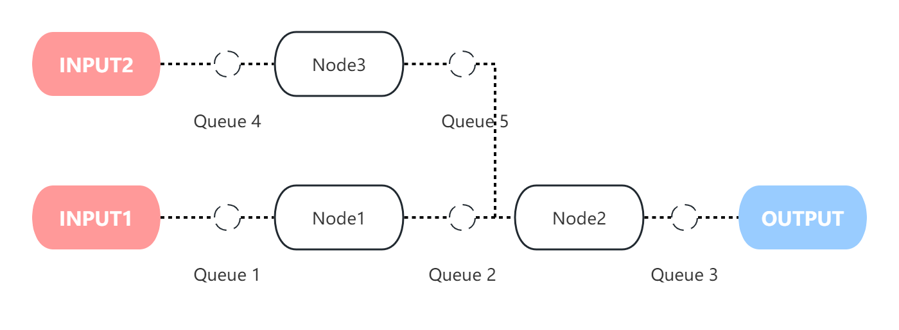

# VideoPipeline 项目说明文档

## 项目简介

VideoPipeline 是一个用于处理和分析视频流数据的模块化 C++ 项目。通过该框架，用户可以配置视频流水线，实现对视频流的处理与分析。项目采用面向对象的设计，具备高扩展性与灵活性。

## 分层框架结构

- SDK层负责与硬件交互
- 算子层负责实现具体模块
- PIPELINE层管理调度算子
- 配置层实现方案便捷集成



### 软件特性

- **配置化视频管道**：用户可以通过简便的配置文件设定节点和管道流程，实现个性化的视频流处理。
- **多节点类型支持**：包含多种节点类型，每种节点实现特定的数据处理功能。
- **多引擎推理支持**：集成多种推理引擎，适配不同硬件环境，为视频分析提供强大支持。
- **高性能支持**：结合CUDA内核模块，提升数据处理和分析的速度。
- **模块化设计**：模块和组件之间通过明确的接口进行交互，支持快速扩展和功能替换。

### 流水线配置

流水线配置的详细内容，参考 [VideoPipeline 配置文件使用指南](docs/Configuration_File_User_Guide.md),
采用可视化配置工具可以提升配置效率，如果未开发对应工具，可临时使用[drawflow_jsoneditor](https://github.com/weinaike/drawflow_jsoneditor)（注意未及时更新，可能存在缺陷）



1. 不同节点处理具体任务，例如，图像解码/校正， 模型推理，逻辑分析等
2. 节点之间设置队列缓冲区，连接数据流的同时，支持各节点并发处理，
3. pipeline支持多输入，多输出
4. 模型相关节点支持单实例批处理，其他节点多实例单帧处理。
5. 同一帧的不同处理结果，挂载到同一对象中，保障数据流转关联性

## 安装指南

### 环境要求

- CMake 3.10 或更高版本
- 支持 C++11 的编译器（如 GCC 4.8 及以上或 Clang 3.3）
- 可选依赖项（根据所需功能选择安装）：
  - CUDA Toolkit
  - TensorRT
  - ONNX Runtime
  - OpenCV
  - FFmpeg

### 构建步骤

1. **克隆项目**:

   ```bash
   git clone git@github.com:weinaike/video_pipeline.git
   cd video_pipeline
   ```
2. **创建构建目录**:

   ```bash
   mkdir build
   cd build
   ```
3. **运行 CMake 配置**:

   ```bash
   cmake -DENABLE_CUDA=ON -DENABLE_TENSORRT=ON -DENABLE_ONNX=ON ..
   ```
4. **构建项目**:

   ```bash
   make -j12
   ```

### 常见问题

- 若遇到库文件找不到或其他编译错误，请确保所有路径和依赖项已正确配置。

## 使用说明

### 启动视频处理管道

1. **配置文件**：根据需要编辑配置文件，定义所需的视频处理管道和节点。
2. **运行项目**：

   - 在项目根目录的终端中执行相应的可执行文件，传入配置文件路径。
   - 例如：`./build/demo configure/pipeline.json`

### 常见问题解决

- 在项目执行过程中，如遇到任何依赖或运行问题，请确保所有库和工具已正确安装，并查看日志输出以获取详细调试信息。

## 项目结构与开发指引

### 项目结构

- **目录划分清晰**：按功能模块分为 `/pipeline`, `/nodes`, `/backend`, `/common` 等子目录。
- **命名空间**：项目使用命名空间 `ZJVIDEO`。

### 开发指南

1. **项目构建**: 使用CMake进行项目的构建和管理。确保编译环境具备项目所需的全部依赖。
2. **节点开发**: 新的节点可以通过继承基本节点类来创建，需要实现特定的处理逻辑，并提供与其它节点的接口。
3. **引擎扩展**: 以实现新的推理引擎时，需实现 `AbstractEngine` 接口，并在 `EngineFactory` 中进行注册。
4. **测试与验证**: 进行充分测试，确保在不同的数据和场景下的稳定性与正确性。

## 项目贡献者

我们欢迎所有对视频处理和分析有兴趣的开发者贡献代码。为了保持代码整洁和一致，请遵循以下原则：

1. **分支管理**：在 GitHub 上 fork 项目并使用 pull request 提交代码。
2. **代码风格**：遵循 Google C++ 风格指南。
3. **测试覆盖**：确保新功能有单元测试覆盖。
